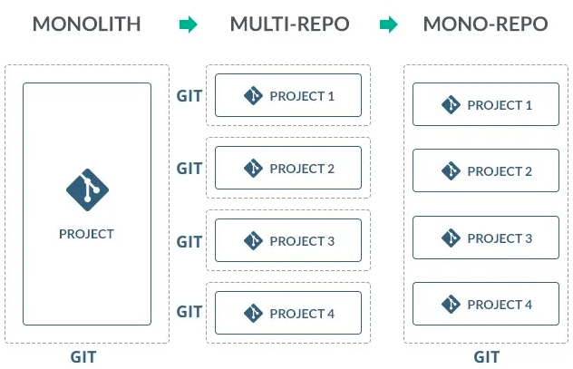
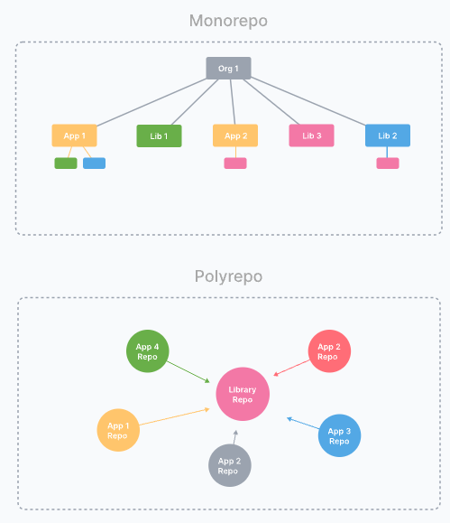
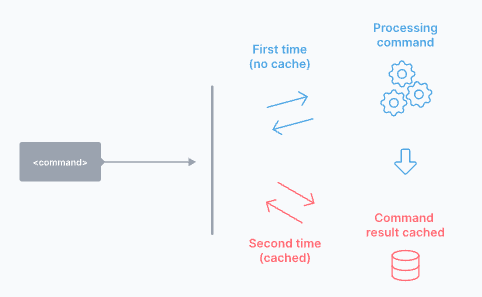
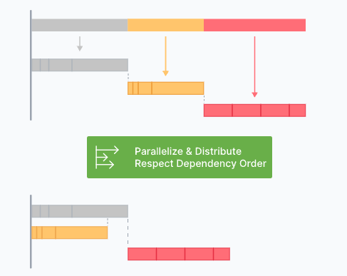
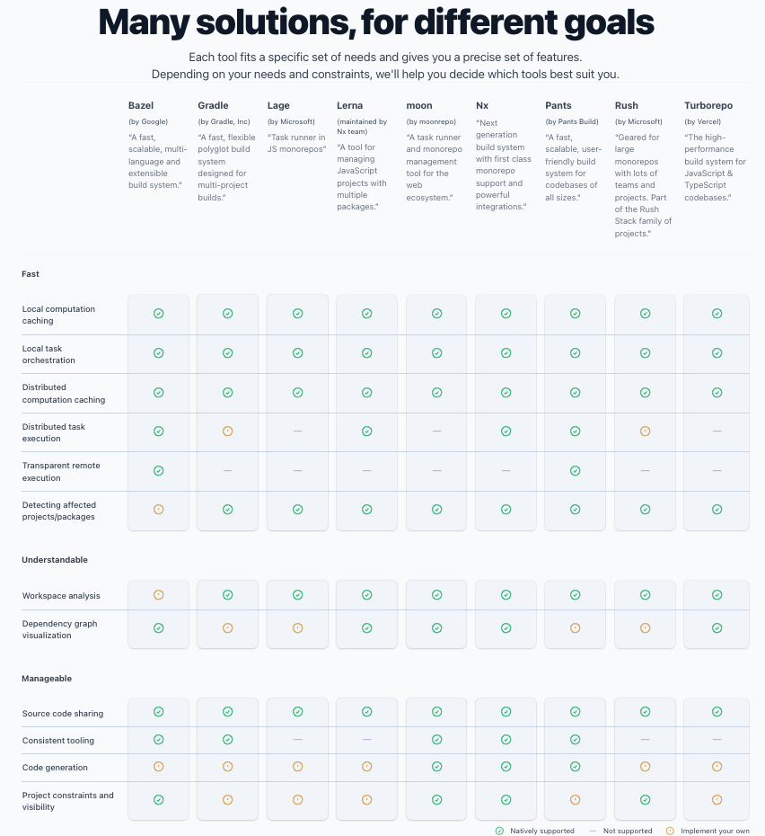

# monorepo-setting
monorepo 셋팅 프로젝트 입니다.

 
 

# 모노레포 개념

## 모놀리식 - 항상 함께
- 모든 코드와 라이브러리를 하나의 저장소에 저장함
- 단일 어플리케이션으로 배포함

 

## 멀티 레포 - 항상 독립적
- 각 서비스 별 코드와 라이브러리를 별도의 저장소에 저장함
- 독립적으로 배포함

 

## 모노레포 - 함께하지만 때론 독립적 (공유, 재사용, 일관성)
- 각 서비스 별 코드와 라이브러리를 하나의 저장소에 저장함
- 독립적으로 배포할 수 있음   
- 공통 코드 재사용성 높아지며, 공통 컨벤션 정의 등으로 일관성 유지하기 쉬움
- 새 프로젝트를 생성하는데 드는 비용이 줄어듬
- 

 

- 모노레포는 각 서비스별 관계가 구조적으로 잘 정리되어 있음    
  → 공통 로직/라이브러리들은 root단에 빠져있고, 이를 각 App에서 가져다 사용하고 있음 

- 모노레포 !== 모놀리식   
단순히 하나의 저장소에 여러 코드가 들어가있다고 모노레포라고 하지 않는다.    
좋은 모노레포는 모놀리식의 반대이다!   
  - 코드 변경 시 모노레포의 모든 프로젝트를 다시 빌드하거나 테스트하지 않음.    
변경 사항에 영향을 받을 수 있는 프로젝트만 다시 빌드하고 테스트하면 됨    
→ CI 속도가 빨라짐 (전체 프로젝트를 빌드, 테스트하지 않아도 되므로. 모놀리식은 전체 빌드 필요)   
→ 모노레포에서 여러 팀이 작업 중일 때, 각 팀에서 작업하는 코드 간 서로 의존성이 없다면 독립적으로 작업이 가능함 (각자 빌드, 머지, PR 가능 등)
- 공통 코드/라이브러리를 변경하면 이에 의존성이 있는 프로젝트들에 영향이 미침
→ 공통 코드(파라미터, 메소드, 클래스, 패키지 등)들은 구버전/신버전 등 두 버전을 생성하여 각 프로젝트들에서 적용할 수 있도록 함

 

## 모놀리식 vs 멀티레포 vs 모노레포

|구분|모놀리식|멀티 레포|모노레포|
|-----|-----|-----|-----|
| 개발 속도 |	빠름 (초기 단계) |	느림 (초기 단계)	| 중간 (초기 단계) |
| 변경 관리 |	어려움 (의존성 충돌) |	쉬움 (독립성) |	중간 (의존성 관리 필요) |
| 배포	| 쉽고 빠름 |	복잡하고 느림	| 중간 (서비스별 배포 가능) |
| 확장성 |	어려움 (단일 코드베이스) |	쉬움 (모듈 분리)	| 중간 (서비스별 확장 가능) |
| 테스트	| 어려움 (전체 테스트 필요)	| 쉬움 (서비스별 테스트 가능) |	중간 (서비스별 테스트 필요) |
| 복잡성	| 낮음 (초기 단계) |	높음 (초기 단계) |	중간 (초기 단계) |
| 팀 협업	| 어려움 (중앙 집중 관리) |	쉬움 (분산 관리)	| 중간 (규칙 및 커뮤니케이션 필요) |

 
 

# point
- 모노레포가 무엇이냐!
- 모노레포 장점이 무엇이냐!
- 사용할 수 있는 툴이 무엇이냐!
- 라이브러리 간 중복 의존성 문제
  (Q) projectA 에서 prettier@3.3.0 을 사용하고, projectB에서도 prettier@3.3.0 을 사용할 때 각 프로젝트 내에서 prettier를 설치하는지? root에서 prettier를 설치하는지인가??
- 효율적인 패키지 설치 방법
  (Q) repo root에서 설치한 패키지와, 각 프로젝트 내에서 설치한 패키지가 동일할 때??
- 각 프로젝트 별 공통 코드 분리, 코드 컨벤션 정의 필요! (모노레포 사용 목적 1)
  (Q) 어디까지 공통화 할 것이며, 프로젝트 별 자유도를 줄 것인가??

 
 

# 모노레포 툴 분석

## 모노레포 툴이 제공해야 할 것
- 로컬 계산 캐싱 (Local computation caching)
  - 동일한 로컬에선 동일한 파일을 두 번 빌드하거나 테스트하지 않음
   
- 로컬 작업 조정 (Local task orchestration)
  - 작업을 병렬로, 올바른 순서로 실행함
  
- 분산 계산 캐싱 (Distributed computation caching)
- 분산 작업 실행 (Distributed task execution)
- 투명한 원격 실행 (Transparent remote execution)
- 영향을 받는 프로젝트/패키지 감지 (Detecting affected projects/packages)
- 워크스페이스 분석 (Workspace analysis)
- 의존성 그래프 시각화 (Dependency graph visualization)
- 코드 공유 (Code sharing)
- 일관된 툴링 (Consistent tooling)
- 프로젝트 제약 및 가시성 (Project constraints and visibility)

 
 

## 모노레포 툴 종류

 

## lerna
- 구성 방법
- 궁합이 좋은 번들러
- 배포 방법??
- 사용 예시 프로젝트

## turborepo

## yarn bery

## pnpm

 
 

# 모노레포 사례
(1) 무신사
- yarn berry & yarn workspace 사용
- yarn의 PnP(Plug'nPlay) 사용
  (Q) PnP는 무엇인가??
- zero-Install 사용
  (Q) zeroInstall은 무엇인가??

 
 

# 참고 문서
- (모노레포 이렇게 좋은데 왜 안써요? - 무신사 테크)
https://medium.com/musinsa-tech/journey-of-a-frontend-monorepo-8f5480b80661
- (Moving from multiple repositories to a lerna-js mono-repo)
https://levelup.gitconnected.com/moving-from-multiple-repositories-to-a-lerna-js-mono-repo-faa97aeee35b
- (monorepo.tools)
https://monorepo.tools/
