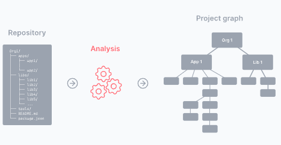

# monorepo-setting

monorepo 셋팅 프로젝트 입니다.

<br/>
<br/>

# 모노레포 개념


## 모놀리식 - 항상 함께

- 모든 코드와 라이브러리를 하나의 저장소에 저장함
- 단일 어플리케이션으로 배포함

<br/>

## 멀티 레포 - 항상 독립적

- 각 서비스 별 코드와 라이브러리를 별도의 저장소에 저장함
- 독립적으로 배포함

<br/>

## 모노레포 - 함께하지만 때론 독립적 (공유, 재사용, 일관성)

- 각 서비스 별 코드와 라이브러리를 하나의 저장소에 저장함
- 독립적으로 배포할 수 있음
- 공통 코드 재사용성 높아지며, 공통 컨벤션 정의 등으로 일관성 유지하기 쉬움
- 새 프로젝트를 생성하는데 드는 비용이 줄어듬
-

<br/>

- 모노레포는 각 서비스별 관계가 구조적으로 잘 정리되어 있음  
   → 공통 로직/라이브러리들은 root단에 빠져있고, 이를 각 App에서 가져다 사용하고 있음
  
- 모노레포 !== 모놀리식  
  단순히 하나의 저장소에 여러 코드가 들어가있다고 모노레포라고 하지 않는다.  
  좋은 모노레포는 모놀리식의 반대이다!
  - 코드 변경 시 모노레포의 모든 프로젝트를 다시 빌드하거나 테스트하지 않음.  
    변경 사항에 영향을 받을 수 있는 프로젝트만 다시 빌드하고 테스트하면 됨  
    → CI 속도가 빨라짐 (전체 프로젝트를 빌드, 테스트하지 않아도 되므로. 모놀리식은 전체 빌드 필요)  
    → 모노레포에서 여러 팀이 작업 중일 때, 각 팀에서 작업하는 코드 간 서로 의존성이 없다면 독립적으로 작업이 가능함 (각자 빌드, 머지, PR 가능 등)
- 공통 코드/라이브러리를 변경하면 이에 의존성이 있는 프로젝트들에 영향이 미침
  → 공통 코드(파라미터, 메소드, 클래스, 패키지 등)들은 구버전/신버전 등 두 버전을 생성하여 각 프로젝트들에서 적용할 수 있도록 함

<br/>

## 모놀리식 vs 멀티레포 vs 모노레포

| 구분      | 모놀리식                  | 멀티 레포                   | 모노레포                         |
| --------- | ------------------------- | --------------------------- | -------------------------------- |
| 개발 속도 | 빠름 (초기 단계)          | 느림 (초기 단계)            | 중간 (초기 단계)                 |
| 변경 관리 | 어려움 (의존성 충돌)      | 쉬움 (독립성)               | 중간 (의존성 관리 필요)          |
| 배포      | 쉽고 빠름                 | 복잡하고 느림               | 중간 (서비스별 배포 가능)        |
| 확장성    | 어려움 (단일 코드베이스)  | 쉬움 (모듈 분리)            | 중간 (서비스별 확장 가능)        |
| 테스트    | 어려움 (전체 테스트 필요) | 쉬움 (서비스별 테스트 가능) | 중간 (서비스별 테스트 필요)      |
| 복잡성    | 낮음 (초기 단계)          | 높음 (초기 단계)            | 중간 (초기 단계)                 |
| 팀 협업   | 어려움 (중앙 집중 관리)   | 쉬움 (분산 관리)            | 중간 (규칙 및 커뮤니케이션 필요) |

<br/>
<br/>

# point

- 모노레포가 무엇이냐!
- 모노레포 장점이 무엇이냐!
- 사용할 수 있는 툴이 무엇이냐!
- 라이브러리 간 중복 의존성 문제
  (Q) projectA 에서 prettier@3.3.0 을 사용하고, projectB에서도 prettier@3.3.0 을 사용할 때 각 프로젝트 내에서 prettier를 설치하는지? root에서 prettier를 설치하는지인가??
- 효율적인 패키지 설치 방법
  (Q) repo root에서 설치한 패키지와, 각 프로젝트 내에서 설치한 패키지가 동일할 때??
- 각 프로젝트 별 공통 코드 분리, 코드 컨벤션 정의 필요! (모노레포 사용 목적 1)
  (Q) 어디까지 공통화 할 것이며, 프로젝트 별 자유도를 줄 것인가??
  - 배포 전략은 어떻게 할 것인가??

<br/>
<br/>

# 모노레포 툴 분석

## 모노레포 툴이 제공해야 할 것 (내가 필요한 기능인지 여부 표기)

- (O) 로컬 계산 캐싱 (Local computation caching)
  - 동일한 로컬에선 동일한 파일을 두 번 빌드하거나 테스트하지 않음
- (O) 로컬 작업 조정 (Local task orchestration)

  - 작업을 병렬로, 올바른 순서로 실행함  
    

- (X) 분산 계산 캐싱 (Distributed computation caching)
  - 다양한 환경에서 캐시 아티팩트 공유함 → CI 에이전트를 포함해 전체 조직이 동일한 것을 두 번 빌드/테스트하지 않음을 의미함  
    (첫번째 작업 시 생성된 캐시는 서버/로컬에 저장하는 듯)  
    
- (X) 분산 작업 실행 (Distributed task execution)
- (X) 투명한 원격 실행 (Transparent remote execution)
  - 로컬에서 개발하는 동안 여러 컴퓨터에서 모든 명령을 실행할 수 있는 기능??
- (O) 영향을 받는 프로젝트/패키지 감지 (Detecting affected projects/packages)
- (△) 워크스페이스 분석 (Workspace analysis)
  - 별도의 설정 없이 작업 공간의 그래프를 이해할 수 있는 기능  
    
- (O) 의존성 그래프 시각화 (Dependency graph visualization)
  - 프로젝트, 작업 간의 종속 관계를 시각화 함
- (△) 코드 공유 (Code sharing)
- (X) 일관된 툴링 (Consistent tooling)
  - 다양한 JS 프레임 워크, Go, Rust, Java 등 개발 언어, 프레임워크 종류 상관 없이 일관된 경험으로 개발할 수 있도록 도와줌
- (X) 코드 생성 (Code generation)
  - 기본 템플릿, 파일 등 기본적으로 필요한 코드를 생성함
- (△) 프로젝트 제약 및 가시성 (Project constraints and visibility)
  - 저장소 내 종속 관계를 제한하는 규칙 정의를 지원함 (ex. 다른 팀에서 해당 프로젝트에 의존할 수 없도록 설정 가능)

<br/>
<br/>

## 모노레포 툴 종류


<br/>
<br/>

## 내가 필요한 기능들에 해당하는 툴??

(O - 꼭 필요한 기능)

- 로컬 계산 캐싱 (Local computation caching)
- 로컬 작업 조정 (Local task orchestration)
- 영향을 받는 프로젝트/패키지 감지 (Detecting affected projects/packages)
- 의존성 그래프 시각화 (Dependency graph visualization)
- +++ 무료일 것!!

<br/>
<br/>


| 일치 | 이름      | 내용                                                                                                                                                                                                                                                                                                                                                                                                                                                                                                                                                                                                                   |
| ---- | --------- | ---------------------------------------------------------------------------------------------------------------------------------------------------------------------------------------------------------------------------------------------------------------------------------------------------------------------------------------------------------------------------------------------------------------------------------------------------------------------------------------------------------------------------------------------------------------------------------------------------------------------- |
| X    | Bazel     | - Google에서 개발한 빌드 시스템 <br/> -c++, java, android, ios 지원 <br/> - 영향 받는 프로젝트/패키지 감지 지원 X                                                                                                                                                                                                                                                                                                                                                                                                                                                                                                      |
| X    | Gradle    | - Gradle에서 개발한 오픈 빌드 시스템 <br/> - java, Android, Kotlin 지원                                                                                                                                                                                                                                                                                                                                                                                                                                                                                                                                                |
| X    | Lage      | - Microsoft에서 개발한 JS monorepo를 위한 task runner <br/> - 캐싱에 초점이 맞춰져있는 것으로 보이며, 의존성 그래프 시각화 미지원 <br/> - 설치 수가 너무 적어 패스함                                                                                                                                                                                                                                                                                                                                                                                                                                                   |
|      | Lerna     | - JavaScript/TypeScript를 위한 최초의 단일 저장소 도구(react, jest 등 여러 프로젝트에서 많이 사용됨) <br/> - Lerna는 Nx 개발사에 인수되어(관리직을 인수한건지 모르겠지만..?) Lerna v6부터 Lerna run 시 Nx의 캐싱, 명령 배포 등의 이점을 무료로 이용할 수 있다고 함 <br/> 🔥 빌드 캐싱 기능은 없으나 패키지 의존성 관리와 버전 관리에 강력함 <br/> - https://lerna.js.org/docs/introduction                                                                                                                                                                                                                             |
| X    | moon      | - Rust로 개발된 task runner, 레포 관리 툴 <br/> - npm에서 @moonrepo/cli 설치해서 사용 가능 <br/> - js, ts 외에도 다양한 언어 지원 <br/> - 설치 수가 너무 적음                                                                                                                                                                                                                                                                                                                                                                                                                                                          |
|      | Nx        | - 내장 도구와 고급 CI 기능을 갖춘 빌드 시스템으로 모노레포 관리 및 확장에 도움을 줌 <br/> - Nx Cloud에서 CI를 제공해주는데, 무료 요금제도 있으나 사용량에 제한적임(개인, 소규모 팀까진 괜춘한듯..) <br/> - Nx Cloud의 CI 를 사용하지 않아도, Github Actions나 CircleCI 등 다른 CI 툴과 연결할 수 있도록 문서 제공함 <br/> - 원격 캐싱은 NxCloud를 사용해야함 <br/> → Nx 를 사용할 때 Nx Cloud를 쓰지 않으면 큰 메리트가 있는지??? <br/> 🔥 로컬 캐싱 및 재사용 기능과 다양한 프레임워크 지원 및 스마트 빌드와 테스트 재실행 등의 기능으로도 Nx 사용은 충분히 메리트 있다고 함 <br/> https://nx.dev/ci/intro/ci-with-nx |
|      | Turborepo | - vercel에서 개발한 모노레포 툴 <br/> - vercel 전체 서비스 사용에 따른 요금제 다름. <br/> - 캐싱은 로컬 캐싱이 기본이므로 빌드하는 각 기계에 따라 재빌드 해야하지만, vercel 과 같은 클라우드 서버를 이용하여 원격 캐싱 가능 (Nx와 같음)                                                                                                                                                                                                                                                                                                                                                                                |

<br/>
<br/>

## 어떤 툴을 선택할 것인가???

- 패키지 매니저
- 모노레포 툴
- 번들러

### 패키지 매니저

🔥 패키지 매니저의 workspaces 기능 분석하기!!!!!!

- npm (https://docs.npmjs.com/cli/using-npm/workspaces)
- yarn (https://yarnpkg.com/features/workspaces)
- pnpm (https://pnpm.io/workspaces)

<br/>
<br/>

#### npm / yarn

<br/>

#### pnpm

🔥 Workspace

- pnpm은 모노레포 구조를 지원함 <br/>
  싱글 레포지토리에서 멀티 프로젝트를 통합하는 워크스페이스를 생성할 수 있음
- 🔥 pnpm은 workspace 지정 시 하위 워크스페이스가 root의 `node_modules`를 참조하도록 설계되어 있음  
  → 하위 워크스페이스에서 root에 설치된 패키지들은 별도로 설치하지 않아도 됨!!!
- pnpm 관련 옵션들은 `.npmrc` 에 추가하거나, command 옵션으로 실행 가능
- Workspace protocol(workspace:)  
  📒 `link-workspace-packages = true`: 로컬에서 사용 가능한 패키지가 nore_modules로 연결됨 <br/> `link-workspace-packages = false`: 로컬에서 사용 가능한 패키지가 registry에서 다운로드 됨
  📒 `workspace:` 프로토콜 사용 시 pnpm은 로컬 작업 공간 패키지 외의 것은 확인을 거부함
  - `link-workspace-packages = true`: 사용 가능한 패키지가 선언된 범위와 일치하면 작업 공간에서 패키지를 연결함 <br/>
    - `workspace:` 사용하지 않았을 경우 (일반적인 경우)
      - 의존성 패키지가 작업 공간에 있음: 해당 패키지로 연결
      - 의존성 패키지가 작업 공간에 없음: registry에서 해당 패키지 신규 설치
    - `workspace:` 사용함 (ex. "foo": "workspace:2.0.0")
      - 의존성 패키지가 작업 공간에 있음: 해당 패키지로 연결
      - 의존성 패키지가 작업 공간에 없음: 설치 실패함
  - `link-workspace-packages = false(default)`: 사용하고자 하는 패키지가 선언된 범위에 없을 때 registry에서 다운로드 됨
    - `workspace:` 사용하지 않았을 경우 (일반적인 경우)
      - 의존성 패키지가 작업 공간에 있음: registry에서 해당 패키지 신규 설치
      - 의존성 패키지가 작업 공간에 없음: registry에서 해당 패키지 신규 설치
    - `workspace:` 사용함 (ex. "foo": "workspace:2.0.0")
      - 의존성 패키지가 작업 공간에 있음: 해당 패키지로 연결
      - 의존성 패키지가 작업 공간에 없음: registry에서 해당 패키지 신규 설치
  - `link-workspace-packages = deep`: 로컬 패키지를 하위 종속성에도 연결해야 하는 경우에 사용
    (alias) `"foo": "workspace:*" 또는 "bar": "workspace:foo@*"` 처럼 사용함 <br/>
    (relative path) `"foo": "workspace:../foo"` 처럼 사용함 <br/>

<br/>

#### yarn berry

<br/>

<br/>
<br/>

### 모노레포 툴

- Lerna
- Nx
- Turborepo (turbo)

<br/>
<br/>

🔥 조언받은 내용

- Turborepo / yarn berry 이용하는 경우 많음
- Turborepo는 구조적으로 깔끔. 최적화 등 개발자가 신경써야할 부분을 툴에서 지원하므로 효율적인 개발 가능, 단 툴에 의존성을 가짐
- yarn berry로 개발 시 툴에 의존성을 가지진 않지만 최적화 등 개발자가 신경써야 할 부분이 ↑. PnP 기능에 대한 이해도 필요!

<br/>

→→ 이번 프로젝트는 Turborepo를 이용하여 모노레포 툴을 사용해보고, 다음 프로젝트에서 yarn berry/pnpm을 이용해 개발해보자!!!

### 번들러

<br/>
<br/>

# 모노레포 사례

- vite
  - https://github.com/vitejs/vite/blob/main/package.json
  - pnpm으로 모노레포 구성함
- 무신사
  - https://medium.com/musinsa-tech/journey-of-a-frontend-monorepo-8f5480b80661
  - yarn berry로 모노레포 구성함

<br/>
<br/>

# 모노레포 구성 시 root에서 설치/셋팅 필요한 패키지/툴

- prettier
- eslint
  - (eslint + typescript) 기존에는 eslint의 parser에 `@typescript-eslint/parser` 추가하여 타입스크립트 구문을 파싱하도록 하였으나, typescript 전용 eslint가 생겼음. (타입도 린팅해줌)
    (typescript-eslint) https://typescript-eslint.io/getting-started/

📒 typescript 사용 시에는 typescript-eslint로 셋팅하는게 좋을듯

<br/>

🔥 eslint와 prettier를 같이 쓸 때, eslint 설정 중 prettier 와 충돌하는 부분을 비활성화하는 `eslint-config-prettier` 를 설치하고, eslint.config.js 를 수정한다.
https://poiemaweb.com/eslint

```
extends: [..., "prettier"]
```

- typescript

<br/>
<br/>

# 배포 방법

🌈 모노레포는 패키지가 독립적으로 빌드 및 배포될 수 있도록 설정해야 함
→ 각 패키지별 package.json에 빌드 스크립트 명시하거나, turborepo등 모노레포 툴 사용 시 root의 package.json에 각 패키지별 빌드 스크립트 명시 필요
🌈 모노레포 프로젝트 내의 각 패키지는 서로 다른 버전을 가질 수 있음
→ 버전 별 의존성 관리 필요
🌈 배포 시 CI / CD 자동화 가능

<br/>
<br/>

🌈 배포 방법
(1) CI/CD 툴 사용

- GitHub Actions: GitHub와 함께 사용하는 무료 CI/CD 서비스
- Jenkins: 오픈 소스 CI/CD 서버
- CircleCI: 클라우드 기반 CI/CD 플랫폼
- Azure DevOps: 마이크로소프트에서 제공하는 CI/CD 서비스

<br/>

(2) 플랫폼 서비스 사용

- Vercel: 프론트엔드 모노레포 배포에 특화된 플랫폼
- Netlify: 정적 웹사이트 및 웹어플리케이션 배포 플랫폼
- AWS Amplify: AWS 기반 웹어플리케이션 배포 서비스

<br/>

(3) 스크립트 사용

- 스트립트 작성 후 실행

(4) 모노레포 툴 사용

- Lerna, Nx, Turborepo 등

<br/>
<br/>

# 배포 단계

- 빌드 단계: 배포 전에 코드 컴파일 및 필요한 자산 생성
- 테스트 단계: 빌드된 코드의 기능 및 성능 테스트
- 배포 단계: 빌드 및 테스트를 통과한 코드를 배포 환경에 배포

<br/>
<br/>

# 배포 전략

- TBD(Trunk Based Development)
-

<br/>
<br/>

# 배포/버전관리 관련 궁금증 AI한테 물어보기

```
그럼 turborepo, npm을 이용하고 jenkins를 이용해 CI/CD 설정하려고 해. root에 utils 폴더는 공통 유틸 파일이 있고, eslint, prettier, typescript 공통 셋팅할 거야. 패키지는 projectA, projectB 가 있고 projectA는 react, projectB는 vue로 설정되어 있어.
```

(1) root 버전이 0.0.0에서 0.1.0으로 변경되었을 때, projectA와 projectB도 버전이 0.1.0으로 변경되어야 하는가?

```
// [ chatGPT ]
Root 버전과 각 패키지의 버전은 독립적으로 관리됩니다. 따라서 root 버전을 0.0.0에서 0.1.0으로 변경해도, projectA와 projectB의 버전은 변경되지 않습니다. 개별 패키지의 버전은 각 패키지의 package.json 파일에서 관리되며, 필요에 따라 독립적으로 변경할 수 있습니다.

// [ Gemini ]
1. root 버전 변경:
package.json 파일에 version 필드를 0.1.0으로 변경합니다.
npm version 0.1.0 명령어를 실행하여 버전 업데이트를 완료합니다.

2. 프로젝트 버전 동기화:
lerna publish 명령어를 실행하면 projectA와 projectB의 버전도 자동으로 0.1.0으로 업데이트됩니다.
각 프로젝트의 package.json 파일에 version 필드를 직접 0.1.0으로 변경해도 됩니다.
```

<br/>

(2) root에 설치된 TypeScript 버전을 변경하면, projectA와 projectB는 새로 빌드하고 npm install을 통해 TypeScript 버전이 변경되는가?

🔥 해당 내용 테스트 통해 확인 필요

```
// [ chatGPT ]
Root에서 TypeScript 버전을 변경하면, 이는 각 패키지에서 사용되는 TypeScript 버전에 영향을 미칠 수 있습니다. 특히, 모노레포 설정에서 각 패키지가 root의 node_modules를 참조하는 경우, 다음과 같은 과정을 통해 변경된 TypeScript 버전이 반영됩니다:

Root에서 TypeScript 버전 변경:
npm install typescript@latest

각 패키지에서 설치된 의존성을 업데이트:
npm install

각 패키지에서 TypeScript 관련 빌드 스크립트를 실행하여 새로운 버전이 반영되었는지 확인:
npm run build


// [ Gemini ]
- Typescript 버전 변경:
root 디렉토리에서 npm install --save-dev typescript@<새 버전> 명령어를 실행하여 typescript 버전을 변경합니다.
- 프로젝트 영향:
변경된 typescript 버전은 자동으로 projectA와 projectB에 적용되지 않습니다.
각 프로젝트 디렉토리에서 npm install --save-dev typescript@<새 버전> 명령어를 별도로 실행해야 합니다.
```

<br/>

(3) 모노레포 배포 시 Turborepo의 배포 스크립트를 이용하면 root와 모든 프로젝트가 빌드 및 배포되는가? projectA만 빌드하고 싶을 때는 어떻게 해야 하는가?

```
// [ chatGPT ]
Turborepo는 작업의 종속성을 기반으로 빌드를 최적화합니다. 특정 패키지만 빌드하거나 배포하려면 다음과 같이 설정할 수 있습니다
1. 모든 패키지를 빌드하는 스크립트:
// root package.json
{
  "scripts": {
    "build": "turbo run build"
  }
}

2. 특정 패키지만 빌드하는 스크립트:
// root package.json
{
  "scripts": {
    "build:projectA": "turbo run build --filter=projectA"
  }
}
Jenkins에서 특정 패키지만 빌드하고 배포하려면, 해당 스크립트를 Jenkins 파이프라인에 추가하면 됩니다.


// [ Gemini ]
모든 프로젝트 배포:
npx turbo run build 명령어를 실행하면 root, projectA, projectB 모든 프로젝트를 빌드하고 배포합니다.

특정 프로젝트 배포:
npx turbo run build --project projectA 명령어를 실행하면 projectA만 빌드하고 배포합니다.
여러 프로젝트를 선택적으로 배포하려면 --project 옵션을 반복적으로 사용합니다. (예: npx turbo run build --project projectA --project projectB)


```

<br/>

(4) root와 projectB는 0.0.0 버전이고, projectA만 1.0.0 버전으로 관리할 수 있는가?

```
// [ chatGPT ]
각 패키지는 독립적으로 버전을 관리할 수 있습니다. 다음과 같이 설정할 수 있습니다:
1. Root의 버전:
// root package.json
{
  "version": "0.0.0",
  "private": true
}

2. projectA의 버전:
// packages/projectA/package.json
{
  "version": "1.0.0",
  "name": "projectA",
  ...
}

3. projectB의 버전:
// packages/projectB/package.json
{
  "version": "0.0.0",
  "name": "projectB",
  ...
}

전체적인 CI/CD 설정 예시
Jenkins를 이용한 CI/CD 설정 예시를 간단히 소개합니다:

1. Jenkinsfile
pipeline {
    agent any

    stages {
        stage('Install dependencies') {
            steps {
                sh 'npm install'
            }
        }
        stage('Build all projects') {
            steps {
                sh 'npm run build'
            }
        }
        stage('Build projectA only') {
            steps {
                sh 'npm run build:projectA'
            }
        }
        stage('Publish projectA') {
            steps {
                script {
                    if (env.BRANCH_NAME == 'main') {
                        sh 'npm publish packages/projectA'
                    }
                }
            }
        }
    }
}


// [ Gemini ]
1. 버전 관리:
각 프로젝트의 package.json 파일에 독립적인 version 필드를 사용하여 버전을 관리할 수 있습니다.
root 버전은 0.0.0, projectA 버전은 1.0.0으로 설정하고, projectB 버전은 0.0.0으로 유지할 수 있습니다.

2. 주의 사항:
root 프로젝트의 변경 사항은 projectA와 projectB에 자동으로 영향을 미치지 않습니다.
각 프로젝트에서 필요한 변경 사항을 별도로 적용해야 합니다.
의존성 관계에 유의하여 버전 충돌을 방지해야 합니다.

3. CI/CD 설정 추가 팁:
Jenkins에서 npm install, lerna publish, turbo run build 명령어를 실행하는 스크립트를 정의하여 자동화된 배포를 구현할 수 있습니다.
테스트 단계를 추가하여 배포 전에 코드 검증을 수행하는 것이 좋습니다.
배포 환경에 맞는 설정을 추가로 조정해야 할 수도 있습니다.
```

<br/>
<br/>

# 참고 문서

- (Moving from multiple repositories to a lerna-js mono-repo)
  https://levelup.gitconnected.com/moving-from-multiple-repositories-to-a-lerna-js-mono-repo-faa97aeee35b
- (monorepo.tools)
  https://monorepo.tools/
- (모노레포와 TBD로 효율적인 배포 파이프라인 구축하기)
  https://velog.io/@chltmdxo3/%EB%AA%A8%EB%85%B8%EB%A0%88%ED%8F%AC%EC%99%80-TBD%EB%A1%9C-%ED%9A%A8%EC%9C%A8%EC%A0%81%EC%9D%B8-%EB%B0%B0%ED%8F%AC-%ED%8C%8C%EC%9D%B4%ED%94%84%EB%9D%BC%EC%9D%B8-%EA%B5%AC%EC%B6%95%ED%95%98%EA%B8%B0
