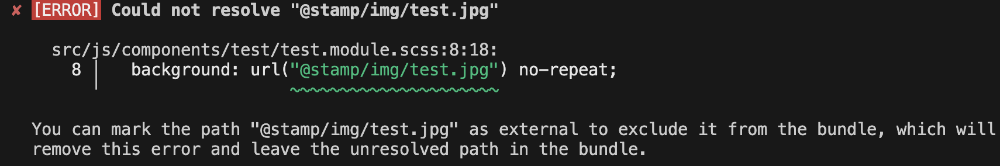

# esbuild 끄적끄적

## esbuild란?

```
매우 빠른 번들러!
https://esbuild.github.io/
```

<br/>

#### build

https://esbuild.github.io/api/#build

- esbuild는 번들러이므로, build는 모듈로 구성된 파일을 하나/여러개의 파일로 묶어주는 작업 진행 (transfile, minify 등등 함께 하겠지만!)
- 주어진 컨텍스트에서 수행되는 모든 빌드는 동일한 빌드 옵션을 공유하며 이후의 빌드는 점진적으로 수행됨
- incremental build 사용함!!

  ```
  ※ incremental build???
    - SW개발에서 이전에 컴파일 된 결과는 재사용해서 빌드 시간을 단축하는 방식
    - 처음부터 다시 빌드하는 대신, 변경된 부분만 빌드함
      → 빌드 시간, 리소스 절약됨
  ```

- esbuild의 incremental build API
  - Watch mode: 파일 시스템을 감시하며 파일 편집/저장 시 자동으로 재빌드 함
  - Serve mode: 최신 빌드 결과를 로컬 개발 서버에 서비스하며, 요청이 오면 자동적으로 새로 빌드함
  - Rebuild mode: 수동으로 빌드함. esbuild 내장 watch, serve 가 아닌 다른 툴 이용 시 유용함

```
const { watch, serve, rebuild } = await esbuild.context({
  entryPoints: ['app.ts'],
  bundle: true,
  outdir: 'dist',
});
```

- 해당 모드들 함께 사용 가능 (ex) liveReload - serve + watch

<br/>
<br/>

#### Transform

<br/>
<br/>

## 🔥 이슈?!! 🔥

| option명   | dev(context)       | build              |
| ---------- | ------------------ | ------------------ |
| assetNames | `[dir]/[name]`     | `[dir]/[name]`     |
| publicPath | x                  | x                  |
| outbase    | x                  | x                  |
| loader     | `{'.jpg': 'file'}` | `{'.jpg': 'file'}` |

- (공통)
  - assets 생성 시 `dist/_.._/assets/...` 로 생성되며, 코드 내에서 경로도 `/_.._/assets`로 되어 있음
- (dev)
  - js에서 `import TestImg from '@src/assets/img/test.jpg';` 이미지 미노출됨.
  - css에서 `background-image: url('../../../assets/img/test.jpg');` 이미지 노출됨.
- (build)
  - js에서 이미지 경로는 `/_.._/assets/...`로 되어 있으나 정상 노출됨
  - css에서 이미지 경로는 `/_.._/assets/...`로 되어 있으나 정상 노출됨

<br/>

📒 (추측) loader와 path 관련 옵션으로 인해 발생한 현상으로 추측되나, 이해하고 있는 내용이 명확하지 않아 다시 찬찬히 보려고 함!!!

- loader
- assetNames
- publicPath
- outbase

<br/>

🔥 해결 방법!!!!

```
// 현재 폴더 구조
- devserver // 개발 서버 폴더
  - dist
  - index.html
  - liveReload.js
- src
  - assets
  - js
  - sass
// dev, build 후 생성 폴더에 아래의 구조로 출력되도록 설정하고자 함
- dist
  - assets
    - img
    - svg
  - index.css
  - index.js
```

```
// esbuild.config.js
// (1) devserver 셋팅
const { watch, serve } = await context({
  entryPoints: [{ in: './src/js/index.tsx', out: './index' }],
  outdir: `devserver/dist`,
  publicPath: '/dist', // devserver가 './'이며, resources들이 /dist 내부에 있어서 publicPath 지정해줘야 함
  outbase: 'src', // src 폴더 내의 구조로 생성될 수 있도록 설정
  assetNames: '[dir]/[name]',
  ...
});
// (2) build 셋팅
await build({
  entryPoints: [{ in: './src/js/index.tsx', out: './index' }],
  outdir: `./dist`,
  outbase: 'src', // src 폴더 내의 구조로 생성될 수 있도록 설정
  assetNames: '[dir]/[name]',
  ...
});
```

- outbase: ‘src’ 로 지정해주지 않으면, “_.._/assets” 폴더에 asset 파일이 생성됨
- devserver에서 publicPath: ‘/dist’ 지정해주지 않으면 js에서 img 경로 잡지 못함 (sass는 정상)

<br/>
<br/>

## loader

<br/>
<br/>

## Content Types

### CSS

- css loader는 파일을 CSS 구문으로 로드함
- loader: css (일반 스타일 파일 로더), global-css / local-css (css module 로더)
  - local-css
    - css를 로컬 범위로 스코핑하여 다른 모듈과 클래스 이름 충돌을 방지하기 위해 사용함
    - 모듈명을 네임스페이스로 붙이고 클래스, 아이디를 고유한 값으로 변환함  
      (ex) styles.module.scss일 때, .button → .styles_button_3aGpk 로 변환함
  - global-css
    - css를 전역 범위로 스코핑하여 다른 모듈과 충돌할 가능성이 있음
    - 클래스와 아이디는 원래 이름 그대로 유지됨
- .css 파일은 css loader가 기본적으로 활성화되며, .module.css 파일은 local-css 로더가 기본적으로 활성화 됨 (esbuild에서 변환한 local css 클래스명을 가져오기 위해 CSS 모듈 코드를 JS 파일로 가져와서 사용해야 함)
- esbuild에서 css 파일을 entry에 직접 연결하여 번들할 수 있음
- js에서 css import 할 경우, css 진입점에서 css 파일들을 가져와 번들하며 js 옆에 해당 js 명으로 번들됨. (ex) app.js에서 호출한 경우 → app.css

#### Sass 셋팅

```
// 폴더 구조
- src
  - js
    - component
      - test
        - Test2.tsx
        - Test2.module.scss
  - sass
    - utils
      - mixin
        - _hidden.scss
        - ...
      - _reset.scss
      - _variable.scss
      - _mixin.scss
    - index.scss

// sass 셋팅 목표
(1) module.scss, src/sass/*.scss → css로 번들링 및 변환
(2) module.scss에서 variable.scss, mixin.scss 코드 사용 가능함
```

<br/>
<br/>

##### (1) module.scss, src/sass/\*.scss → css로 번들링 및 변환

```
// esbuild-sass-plugin 설치
https://www.npmjs.com/package/esbuild-sass-pluginload


// esbuild.config.js

{
  ...
  plugins: [
    // sass module - .scss보다 먼저 선언되어야 함
    sassPlugin({
      filter: /\.module\.scss$/,
      type: 'local-css',
    }),

    // sass
    sassPlugin({
      filter: /\.scss$/,
      cssImports: true,
      type: 'css',
    }),
  ],
}
```

- type: 'local-css'
  - esbuild의 내장 CSS 모듈 지원(local-css loader)을 사용함

[ 참고 ]
(esbuild-sass-plugin) https://www.npmjs.com/package/esbuild-sass-pluginload
(esbuild ContentType - CSS) https://esbuild.github.io/content-types/#css

<br/>
<br/>

##### (2) module.scss에서 variable.scss, mixin.scss 코드 사용 가능함

```
// esbuild.config.js

{
  ...
  plugins: [
    // sass module - .scss보다 먼저 선언되어야 함
    sassPlugin({
      filter: /\.module\.scss$/,
      type: 'local-css',
      precompile(source, pathname, isRoot) {
        /*
          - module.css에서도 mixin, variable 사용할 수 있도록
          - precompile에 추가하지 않을 경우 각 module.css에서 @use 구문 추가 후 사용해야 함
        */
        return isRoot
          ? `@use '../../../sass/utils/_variable.scss' as *;\n@use '../../../sass/utils/_mixin.scss' as *;\n${source}`
          : source;
      },
    }),

    // sass
    sassPlugin({
      filter: /\.scss$/,
      cssImports: true,
      type: 'css',
    }),
  ],
}
```

- (esbuild-sass-plugin) precompile

  - compile 전에 진행해야 하는 작업들을 정의함
  - 다른 스타일 파일로 정의한 variable, mixin을 css 모듈에서 사용하기 위해선 각 css 모듈 파일에서 @use 구문으로 해당 파일들을 호출해야하는데, 매번 모듈 파일에서 추가하기 번거로우므로 scss -> css 컴파일 전에 필요한 전역 scss 파일이 추가될 수 있도록 정의함  
    (단, 모듈에서 variable, mixin 코드를 사용했을 때만 해당 코드를 가져오며, 사용하지 않으면 treeshaking됨)
  - @import 중첩을 피하기 위해 isRoot일 때만 추가하도록 정의함
  - https://www.npmjs.com/package/esbuild-sass-plugin#--globals-and-other-shims-like-sass-loaders-additionaldata

  ```
  // Test2.module.scss
  .test {
    background: yellow;
    color: $primary; // variable 사용
    @include hidden; // mixin 사용
  }


  // index.css (번들된 css)
  /* src/js/components/test2/test2.module.scss */
  .test2_module_test {
    background: yellow;
    // variable 사용
    color: #6490e7;

    // mixin 사용
    display: block;
    position: absolute;
    clip: rect(0 0 0 0);
    width: 1px;
    height: 1px;
    margin: -1px;
    overflow: hidden;
  }


  // index.css.map
  {
    "version": 3,
    "sources": [
      "../../src/js/components/test2/test2.module.scss",
      "../../src/sass/utils/_variable.scss",
      "../../src/sass/utils/mixin/_hidden.scss",
      "../../src/sass/style.scss",
      "../../src/sass/utils/_reset.scss"
    ],
    "sourcesContent": [
      "@use '../../../sass/utils/_variable.scss' as *;\n@use '../../../sass/utils/_mixin.scss' as *;\n.test {\n  background: yellow;\n  color: $primary;\n  @include hidden;\n}\n",
    ]
    ...
  }
  ```

- (sass) @use
  - @use는 다른 sass 스타일 시트의 variable, mixin, function 등을 로드하고 여러 스타일 시트의 css를 결합함
  - @use에 의해 로드된 스타일 시트를 "모듈" 이라고 함
  - @use "url" 로 로드된 모든 스타일은 몇 번 로드되든 상관 없이 컴파일된 CSS 출력에 정확히 한 번만 포함됨
  - esbuild의 css module에서 /sass/의 variable, mixin 등 precompile에서 다른 sass 파일을 가져올 때 @import / @use 둘 다 사용해도 이슈 없음. 단, 추후 sass에서 @import 구문이 없어지고, 모듈에 좀더 특화된 @use 를 사용하는 것이 좋겠음 (아래 내용 참고)
  - https://sass-lang.com/documentation/at-rules/use/

```
@import vs @use

@import
- 스타일 시트를 포함하고 CSS 규칙을 상속받으며, 포함된 파일의 모든 스타일이 전역에 적용됨
- 동일한 파일이 여러번 포함될 수 있으며, 코드 중복 포함 문제가 발생할 수 있음
- @import 로 호출할 파일의 명칭들은 중복되지 않도록 길게 사용하는 경우 많았음 (ex. $main-boarder-color)
- 향후 sass 에서 제거 예정이라고 함
- 예시
// variables.scss
$primary-color: blue;

// styles.scss
@import 'variables';

body {
  color: $primary-color;
}


@ use
- 모듈 시스템을 사용하여 스타일 시트를 포함하고, 네임 스페이스를 사용하여 코드의 범위를 제한함 (별도의 네임스페이스가 없으면 모듈명(파일명)으로 사용함)
- 동일한 파일이 한 번만 포함되어 중복 방지함
- 예시
// variables.scss
$primary-color: blue;

// styles.scss
@use 'variables'; // 별도의 네임스페이스가 없으면 모듈명(파일명)으로 사용함

body {
  color: variables.$primary-color;
}

// 네임 스페이스 변경 가능
@use 'variables' as vars;

body {
  color: vars.$primary-color;
}

// 네임스페이스 없이 사용
@use 'variables' as *;

body {
  color: $primary-color;
}

🤨 예제 코드에서 Test.modules.scss, Test2.modules.scss 둘다 variable, mixin 을 @import, @use 로 호출한 결과, esbuild로 번들한 css.map 파일에서(index.css.map)에서 확인했을 때 (1) 코드 중복은 보이지 않았음 (.css.map.sourcesContent) (2) css modules 내에서 @import / @use 호출한 variable 값을 변경해서 사용했을 때 다른 모듈 스타일에 영향 없었음 (esbuild의 css module 파일은 local-css로 로컬 스코프에 적용되기 때문인 듯)
→ @import / @use 에서 말하는 내용은 sass 내부에서 사용할 때 이슈로 보임

🔥 esbuild의 css module에서 /sass/의 variable, mixin 등 precompile에서 다른 sass 파일을 가져올 때 @import / @use 둘 다 사용해도 이슈 없음. 단, 추후 sass에서 @import 구문이 없어지고, 모듈에 좀더 특화된 @use 를 사용하는 것이 좋겠음
```

<br/>
<br/>

##### assets import 시 경로 가공 - (1) alias path (2) relative path

###### (1) alias path

```
// tsconfig.json (typescript 셋팅했을 경우)
// typescript로 셋팅하였으나, tsconfig.compilerOptions.paths에 해당 alias path값이 없으면 esbuild에서 에러 발생함
{
  ...
  "compilerOptions": {
    "paths": {
      ...
      "@img/*": ["assets/img/*"],
      "@svg/*": ["assets/svg/*"],
    }
  }
}
```

<br/>

```
// esbuild.config.js
// sass
  sassPlugin({
    filter: /\.scss$/,
    cssImports: true,
    type: 'css',
    importMapper: (path) => path.replace(/^@img\//, './assets/img/').replace(/^@svg\//, './assets/svg/'),
  }),
```

<br/>

※ tsconfig.json에 paths 추가하지 않았을 때 발생하는 오류

<br/>
<br/>
