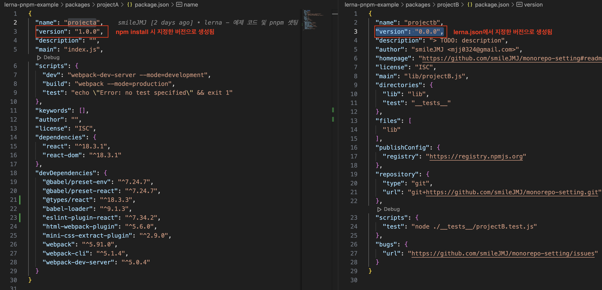

# Lerna로 모노레포 셋팅하기

https://lerna.js.org/docs/introduction

<br/>
<br/>

# Why Lerna?

🔥 Super Fast! <br/>
Lerna is fast, even faster than most comparable solutions out there (see this benchmark to learn more). How? Under the hood, Lerna v6+ uses Nx to run tasks. Learn more about running tasks here. <br/>  
→ Lerna v6부터 Nx 에서 돌림. 빠름빠름
🔥 Computation Caching <br/>
Lerna knows when the task you are about to run has been executed in the past. Instead of running it, Lerna will restore the files and replay the terminal output instantly. Plus, this cache can be shared with your co-workers and CI. When using Lerna, your whole organization will never have to build or test the same thing twice. <br/>
🔥 Configuration-Free Distributed Task Execution <br/>
Lerna can distribute any command across multiple machines without any configuration, while preserving the dev ergonomics of running it on a single machine. In other words, scaling your monorepo with Lerna is as simple as enabling a boolean flag. See the examples of how enabling DTE can make you CI 20 times faster.
🔥 Beautiful Terminal Output <br/>
Monorepos can have hundreds or thousands of projects. Printing everything on every command makes it hard to see what fails and why. Thankfully, Lerna does a much better job.
🔥 Powerful Graph Visualizer Lerna comes with a powerful interactive visualizer simplifying the understanding of your workspaces.
🔥 Publishing to NPM <br/>
Lerna is the ultimate tool for publishing multiple packages to npm. Whether the packages have independent versions or not, Lerna has you covered.
🔥 Easy to Adopt Even with all these capabilities, Lerna is very easy to adopt. It requires close-to-zero configurations. Want to see how?

<br/>
<br/>

# 셋팅하면서 확인해야 할 내용

[ ] root
[O] pnpm 초기화 및 설정
[O] lerna 초기화 및 설정
[O] util 폴더에 공통 파일 생성
[O] prettier, lint 설정
[O] 하위 워크스페이스
[O] projectA에 npm 초기화
[o] projectA에 react 및 webpack 셋팅
[O] root - 하위 워크스페이스 의존성 연결
[O] proejctA의 webpack.config.js에서 root 경로 resolve.alias 설정 후 정상적으로 import 되는지 확인하기
[O] projectA의 App.jsx에서 root의 util 파일 가져와 사용해보기
[O] root에서 설치한 prettier, lint 패키지를 projectA에서 보도록 설정하기 (workspace: / link-workspace-packages)  
→ root단에서 workspace 지정되어 있으면, 하위 워크스페이스에서 따로 해줄 것 없이 바로 사용 가능
[O] 하위 패키지에서 root의 prettier, lint 설정 가져와 사용해보기
[O] devServer 실행
[O] projectA 내부에서 webpack-dev-server 실행
[O] build 실행
[O] projectA 내부에서 build 실행
[O] root에서 build 실행
[ ] deploy
[ ] github actions 테스트해보기
[ ] 사내 환경의 CI/CD에 적용할 방법 고민해보기
[ ] lerna 장점 / 특징 무엇인지 고민해보기
[ ] nx, turborepo 와 비교해보기

<br/>
<br/>

# root - pnpm으로 셋팅하기

https://lerna.js.org/docs/recipes/using-pnpm-with-lerna

(0) pnpm 설치 및 초기화하기
`npx pnpm init -y`  
※ pnpm 을 global로 설치해두지 않을 경우, 빌드 시 아래와 같은 에러가 발생할 수 있습니다.

```
/bin/sh: pnpm: command not found
sh: pnpm: command not found
```

→ `npm install -g pnpm` 으로 전역 설치하면 해결됩니다.  
(발생원인) lerna가 하위 패키지의 빌드를 실행할 때 pnpm을 사용하도록 설정되어 있는 경우 pnpm이 전역으로 설치되어 있어야 합니다.

(1) root 폴더의 node_modules 삭제하기

<br/>

(2) lerna.json 추가하여 아래 코드 입력하기

```
{
  "npmClient": "pnpm",
  "version": "1.0.0"
}
```

<br/>

(3) root 폴더에 pnpm-workspace.yaml 추가 후 아래 구문 추가하기

- yarn/npm의 package.json에 "workspaces" 속성이 있으면 제거하기 (lerna는 pnpm-workspace.yaml을 봄, yarn/npm 일 땐 package.json에 workspaces 속성 추가해야 함)

```
# pnpm-workspace.yaml

packages:
  - "packages/*"
```

📒 pnpm-workspace.yaml: 모노레포 내에서 관리되는 패키지들의 위치를 pnpm에게 알려주는 역할

<br/>

(4) `pnpm install -D lerna`

<br/>

(5) lerna init

- 빈 프로젝트에서 시작할 때: `npx lerna@latest init --dryRun` (--dryRun: lerna init 이 파일 시스템에 적용할 변경 사항을 미리 볼 수 있음)
- repo가 있을 때: `npx lerna@latest init --packages="packages/*"` 또는 `npx lerna@latest init --packages="foo/*" --packages="bar/*"`

🔥 Lerna 는 자동적으로 버전과 태그를 생성해주며, 패키지 레지스트리에 패키지 게시함

<br/>

(6) 하위 workspace 생성하기

- projectA 는 /packages/projectA 폴더 직접 생성하여 셋팅함
  - projectA에서 react 등 패키지 설치 시 npm을 이용하여 내부에서 직접 설치함
- projectB는 lerna cli 를 사용하여 `lerna create projectB` 생성함  
  https://lerna.js.org/docs/api-reference/commands
  (**tests**, lib 폴더 생성됨)

  🔥 lerna cli로 생성한 경우, lerna.json에서 정의한 버전으로 생성 + 그 외 정보들도 root 정보 종속되어 생성되므로 lerna cli 를 사용하자~!!!!

  

  <br/>

  🔥 lerna v7부터 `lerna bootstrap`, `lerna add`, `lerna link` remove → npm/yarn/pnpm의 workspaces 사용하면 됨!!

  - 모노레포에서의 의존성 설치/연결해주는 작업을 lerna 가 진행하지 않고, 패키지 매니저인 npm, yarn, pnpm의 workspace 기능을 사용하도록 변경됨
  - https://lerna.js.org/docs/legacy-package-management#migrating-from-lerna-bootstrap-lerna-add-and-lerna-link-in-lerna-v7-and-later

    <br/>

  - npm (https://docs.npmjs.com/cli/using-npm/workspaces)
  - yarn (https://yarnpkg.com/features/workspaces)
  - pnpm (https://pnpm.io/workspaces)

(7) Run
`npx lerna run build`

- root 에서 빌드 진행
- scope 가 없으므로 전체 패키지 전부 빌드됨

<br/>

`npx lerna run build --scope=header`

- root 에서 빌드 진행
- scope에 패키지명 추가하여 해당 패키지만 빌드됨

<br/>

(8) root에서 typescript, prettier, lint 셋팅하기

- root에서 `npx pnpm install -D prettier eslint` 설치하기
- 이 때, 아래와 같은 경고 메시지 발생

```
ERR_PNPM_ADDING_TO_ROOT  Running this command will add the dependency to the workspace root, which might not be what you want - if you really meant it, make it explicit by running this command again with the -w flag (or --workspace-root). If you don't want to see this warning anymore, you may set the ignore-workspace-root-check setting to true.
```

→ pnpm에서 해당 명령이 root에서 실행되어 전체 워크스페이스에 의도하지 않는 영향을 미칠 수 있음을 알려줌
→ root에서 prettier, lint 설치하는 등 root단에서 셋팅할 수 있으므로 해당 경고가 발생하는 것은 번거로움.. 이를 발생시키지 않으려면?

- `-w`, `--workspace-root` 플래그를 추가하여 경고 무시 가능
  (ex) `npx pnpm install -D -w prettier eslint`
- `.npmrc`에서 `ignore-workspace-root-check: true` 로 변경
- Microsoft에서 생성/관리하는 eslint config 인 `@rushstack/eslint-config`을 상속받아 사용해봄  
  https://www.npmjs.com/package/@rushstack/eslint-config
- (eslint + react) react 사용 시 react관련 문법 파싱위해 `eslint-plugin-react`를 설치한 후, eslint.config.js의 extends에 추가 및 plugins에 추가한다.
  https://www.npmjs.com/package/eslint-plugin-react

  ```
  ...
  plugins: ['react'],
  extends: ['plugin:react/recommended']
  ```

- (eslint + typescript) 기존에는 eslint의 parser에 `@typescript-eslint/parser` 추가하여 타입스크립트 구문을 파싱하도록 하였으나, typescript 전용 eslint가 생겼음. (타입도 린팅해줌)
  (typescript-eslint) https://typescript-eslint.io/getting-started/

📒 typescript 사용 시에는 typescript-eslint로 셋팅하는게 좋을듯

<br/>

🔥 eslint와 prettier를 같이 쓸 때, eslint 설정 중 prettier 와 충돌하는 부분을 비활성화하는 `eslint-config-prettier` 를 설치하고, eslint.config.js 를 수정한다.
https://poiemaweb.com/eslint

```
extends: [..., "prettier"]
```
